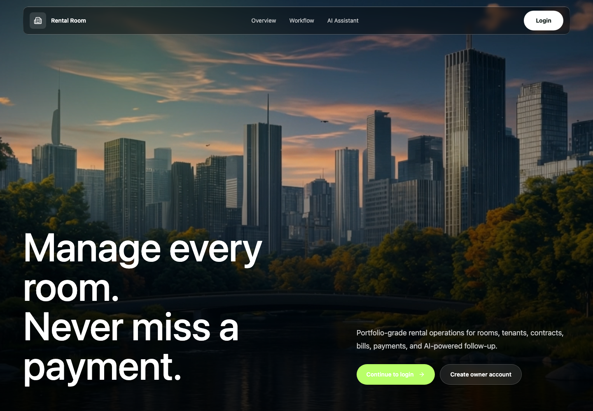
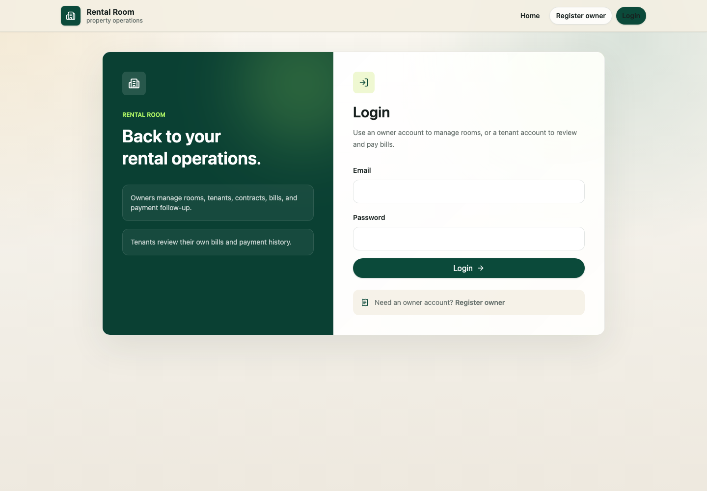
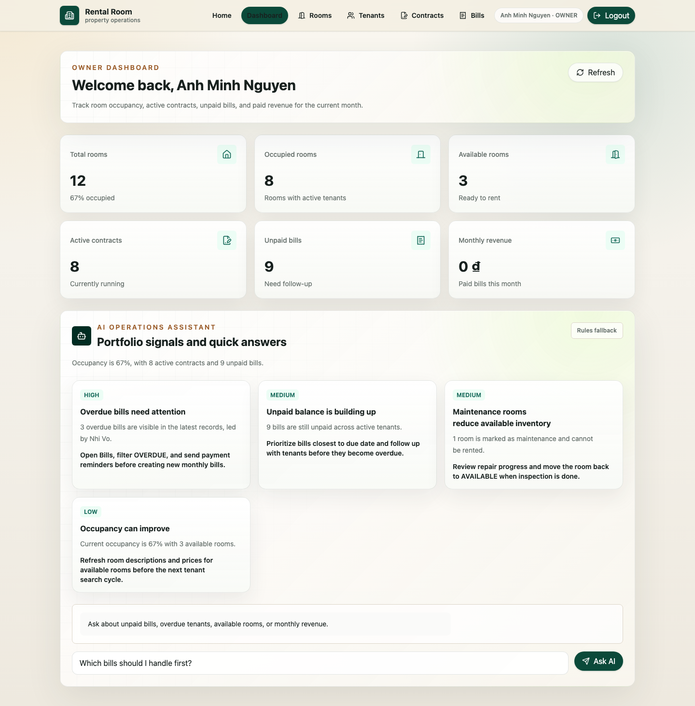
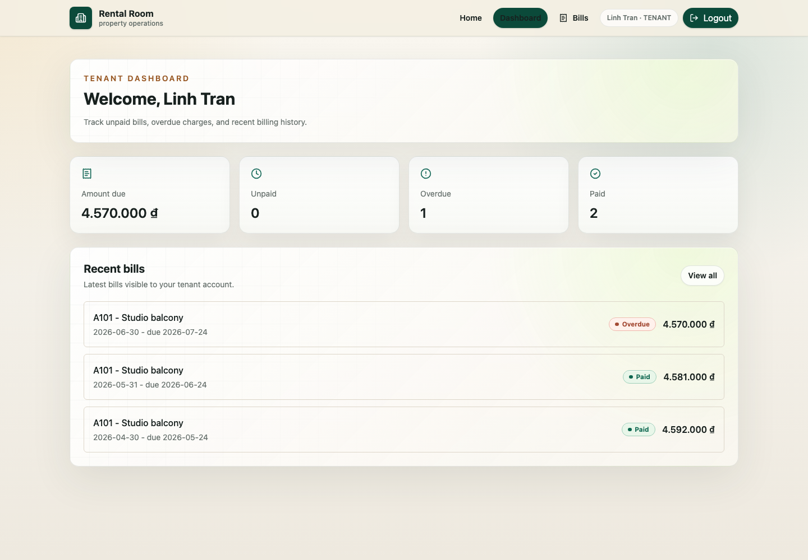

# Rental Room Management

Full-stack rental room management project for internship CV.

## Deployed MVP

```text
Frontend: https://rental-room-management-henna.vercel.app
Backend:  https://rental-room-backend-642g.onrender.com
Health:   https://rental-room-backend-642g.onrender.com/health
Swagger:  https://rental-room-backend-642g.onrender.com/swagger-ui/index.html
```

Day 28 deployed smoke test passed:

- Frontend Vercel root and protected route refresh return `200`.
- Backend Render `/health` returns `{"status":"ok"}`.
- CORS allows the Vercel origin.
- Owner can register/login against the deployed backend.
- Owner can create room, tenant, contract, and bill.
- Active contracts mark rooms as occupied.
- Tenant can login, can only see their own bills, and can pay through mock payment.
- Paid bill updates owner dashboard revenue.
- Ending a contract releases the room back to available.
- GitHub Actions CI runs backend tests and frontend build/lint.

Latest deployed demo credentials:

```text
Owner:  owner.demo.20260713151259@example.com
Tenant: linh.tran.20260713151259.1@example.com
Password for both: Demo123456
```

Render free instances sleep, so the first backend request can take around 30-60 seconds.

## Screenshots

### Landing page



### Login



### Owner dashboard



### Tenant dashboard



## Current Scope

Day 1-2 foundation is in place:

- Spring Boot backend scaffold.
- PostgreSQL and Redis local services through Docker Compose.
- User entity with `ADMIN`, `OWNER`, `TENANT` roles.
- JWT register/login flow.
- Basic stateless Spring Security configuration.
- Owner room CRUD with pagination, search, sorting, and status filter.
- Owner tenant profile CRUD with tenant account creation.
- Contract create/list/detail/update/end with room status updates.
- Bill create/list/detail with automatic total calculation.
- Mock tenant payment flow for bills.
- Owner dashboard summary API.
- Redis-backed login rate limiting.
- Swagger/OpenAPI documentation.
- Standard API error responses for validation, malformed JSON, not found, conflict, and forbidden errors.
- Backend service and MockMvc integration tests for auth and role-based access.
- Test profile using H2 so backend tests can run without local Docker.
- React + Vite + TypeScript frontend foundation with Tailwind, shadcn/ui conventions, routing, and API client.
- Frontend login flow with JWT storage, current-user session loading, protected routes, role redirects, and logout.
- OWNER dashboard page connected to the backend summary API.
- OWNER rooms frontend with list, filters, detail, create, edit, and delete flows.
- OWNER tenants frontend with list, search, detail, create, edit, and delete flows.
- OWNER contracts frontend with list, filters, create, detail, and end-contract flow.
- Bills frontend for owners and tenants, bill detail actions, and TENANT dashboard.
- Tenant bill detail can start MoMo sandbox payment or use the local mock payment fallback.
- AI-assisted owner insights, owner Q&A, and bill reminder drafting with a rules fallback when no OpenAI key is configured.
- Cinematic landing page, owner registration page, polished owner/tenant dashboard UI, and responsive public/auth screens.

## Local Backend Setup

Required local services:

```text
PostgreSQL: localhost:5433
Redis:      localhost:6379
Backend:    localhost:8080
```

Start PostgreSQL and Redis:

```bash
docker compose up -d
```

Check Docker services:

```bash
docker compose ps
docker compose exec postgres pg_isready -U postgres -d rental_room_db
docker compose exec redis redis-cli ping
```

Run backend tests:

```bash
cd backend
./mvnw test
```

Run backend:

```bash
cd backend
./mvnw spring-boot:run
```

Stop backend with `Ctrl+C`.

Stop Docker services when you are done:

```bash
docker compose down
```

Open API documentation:

```text
http://localhost:8080/swagger-ui/index.html
```

For protected endpoints, click `Authorize` in Swagger UI and paste a JWT access token from `/auth/login`.

## Backend Environment Variables

The backend has local defaults for development, so you can run it without exporting variables after Docker is up.

```text
SPRING_DATASOURCE_URL=jdbc:postgresql://localhost:5433/rental_room_db
SPRING_DATASOURCE_USERNAME=postgres
SPRING_DATASOURCE_PASSWORD=postgres
SPRING_DATA_REDIS_HOST=localhost
SPRING_DATA_REDIS_PORT=6379
APP_JWT_SECRET=change-this-secret-key-change-this-secret-key
APP_JWT_EXPIRATION_MS=86400000
APP_RATE_LIMIT_ENABLED=true
APP_CORS_ALLOWED_ORIGINS=http://localhost:5173
APP_MOMO_ENDPOINT=https://test-payment.momo.vn/v2/gateway/api/create
APP_MOMO_PARTNER_CODE=
APP_MOMO_ACCESS_KEY=
APP_MOMO_SECRET_KEY=
APP_MOMO_REDIRECT_URL=http://localhost:5173/tenant/bills
APP_MOMO_IPN_URL=http://localhost:8080/payments/momo/ipn
```

Tests use the `test` profile with H2 and `APP_RATE_LIMIT_ENABLED=false`, so tests do not need Docker.

## Local Frontend Setup

Install frontend dependencies:

```bash
cd frontend
npm install
```

Run frontend:

```bash
cd frontend
npm run dev
```

Build frontend:

```bash
cd frontend
npm run build
```

The frontend calls the backend at `http://localhost:8080` by default. Override it with:

```bash
VITE_API_BASE_URL=http://localhost:8080 npm run dev
```

## Business Workflow Smoke Test

Use the smoke script when you want to verify the whole owner-to-tenant workflow through API calls.
It creates a fresh owner, room, tenant, active contract, bill, mock payment, and then ends the contract.

Run against local backend:

```bash
node scripts/smoke-business-workflow.mjs
```

Run against deployed Render backend:

```bash
API_BASE_URL=https://rental-room-backend-642g.onrender.com node scripts/smoke-business-workflow.mjs
```

The script verifies:

- Owner register/login.
- Owner creates room, tenant, contract, and bill.
- Active contract changes room status to `OCCUPIED`.
- Tenant login works.
- Tenant bill list only contains that tenant's bills.
- Tenant mock payment marks bill as `PAID`.
- Owner dashboard monthly revenue becomes positive.
- Ending the contract changes room status back to `AVAILABLE`.

## CI

GitHub Actions runs on pushes to `main` and pull requests:

- Backend: `./mvnw test`
- Frontend: `npm ci`, `npm run build`, `npm run lint`

## Vercel Frontend Deployment

Day 26 deploys the React/Vite frontend to Vercel.

Deploy steps:

1. Open Vercel Dashboard and choose `Add New > Project`.
2. Import the GitHub repo `binhtranqs/rental-room-management`.
3. Set the project root directory to `frontend`.
4. Keep framework preset as `Vite`.
5. Confirm build settings:

```text
Install Command: npm install
Build Command: npm run build
Output Directory: dist
```

6. Add this environment variable:

```text
VITE_API_BASE_URL=https://rental-room-backend-642g.onrender.com
```

7. Deploy.

`frontend/vercel.json` rewrites all frontend routes to `index.html`, so refreshing protected React Router pages does not return a Vercel 404.

After Vercel gives you a frontend URL, update Render `rental-room-backend` environment:

```text
APP_CORS_ALLOWED_ORIGINS=https://your-vercel-domain.vercel.app
```

Then redeploy or restart the Render backend.

## Render Backend Deployment

Day 25 prepares backend deployment with `render.yaml` at the repository root. The Blueprint creates:

- `rental-room-backend`: Docker-based Spring Boot web service.
- `rental-room-db`: Render PostgreSQL database on the free plan.
- `/health`: public health check endpoint for Render.

Render injects a PostgreSQL `DATABASE_URL`; `backend/render-entrypoint.sh` converts it to Spring's JDBC datasource environment variables before starting the jar.

Deploy steps:

1. Push the latest `main` branch to GitHub.
2. Open Render Dashboard and choose `New > Blueprint`.
3. Connect the GitHub repo `binhtranqs/rental-room-management`.
4. Use the default Blueprint path `render.yaml`.
5. Fill these `sync: false` values when Render asks:

```text
APP_CORS_ALLOWED_ORIGINS=https://your-vercel-domain.vercel.app
APP_MOMO_PARTNER_CODE=<MoMo sandbox partner code, optional for mock-only demo>
APP_MOMO_ACCESS_KEY=<MoMo sandbox access key, optional for mock-only demo>
APP_MOMO_SECRET_KEY=<MoMo sandbox secret key, optional for mock-only demo>
APP_MOMO_REDIRECT_URL=https://your-vercel-domain.vercel.app/tenant/bills
APP_MOMO_IPN_URL=https://your-render-backend.onrender.com/payments/momo/ipn
```

`APP_JWT_SECRET` is generated by Render. `APP_RATE_LIMIT_ENABLED=false` is used for the deployed MVP so Redis is not required in Render.
Before clicking Deploy Blueprint, confirm the estimated pricing is `$0/month`. If Render shows a paid database plan, cancel and check that `render.yaml` has `plan: free` under `databases`.

After deployment, check:

```text
https://your-render-backend.onrender.com/health
https://your-render-backend.onrender.com/swagger-ui/index.html
```

## CV Summary

Suggested CV bullet:

```text
Built and deployed a full-stack rental room management platform with Spring Boot, PostgreSQL, JWT role-based auth, React, TypeScript, owner/tenant dashboards, contract lifecycle automation, billing, mock payments, CI, and AI-assisted owner workflows.
```

## Login Rate Limit

Failed `/auth/login` attempts are tracked in Redis with keys like `login:rate:{email}`.
After 5 failed attempts within 15 minutes, the API returns `429 Too Many Requests`.
A successful login clears that email's failed-attempt counter.

Rate limiting is enabled by default. Disable it locally with:

```bash
APP_RATE_LIMIT_ENABLED=false ./mvnw spring-boot:run
```

## Auth Endpoints

Register:

```http
POST /auth/register
```

Login:

```http
POST /auth/login
```

Current user:

```http
GET /auth/me
Authorization: Bearer <token>
```

## Room Endpoints

All room endpoints require an `OWNER` token.

```http
GET /rooms?page=0&size=10&sort=createdAt,desc&keyword=school&status=AVAILABLE
GET /rooms/{id}
POST /rooms
PUT /rooms/{id}
DELETE /rooms/{id}
```

Create/update body:

```json
{
  "name": "Room A1",
  "address": "District 1",
  "area": 25.0,
  "price": 3500000,
  "status": "AVAILABLE",
  "description": "Near school"
}
```

## Contract Endpoints

Owners can create, update, and end contracts. Owners and tenants can list/detail visible contracts.

```http
GET /contracts?page=0&size=10&sort=createdAt,desc&keyword=demo&status=ACTIVE
GET /contracts/{id}
POST /contracts
PUT /contracts/{id}
PATCH /contracts/{id}/end
```

Create/update body:

```json
{
  "tenantId": 1,
  "roomId": 1,
  "startDate": "2026-06-03",
  "endDate": "2027-06-03",
  "deposit": 1000000,
  "monthlyRent": 3500000,
  "status": "ACTIVE"
}
```

Creating an `ACTIVE` contract marks the room as `OCCUPIED`. Ending a contract marks the room as `AVAILABLE`.

## Bill Endpoints

Owners can create bills for active contracts they own. Owners and tenants can list/detail visible bills.

```http
GET /bills?page=0&size=10&sort=createdAt,desc&keyword=demo&status=UNPAID&month=2026-06-01
GET /bills/{id}
POST /bills
PATCH /bills/{id}/mark-paid
```

Create body:

```json
{
  "contractId": 1,
  "month": "2026-06-01",
  "roomRent": 3500000,
  "electricityFee": 150000,
  "waterFee": 100000,
  "serviceFee": 100000,
  "dueDate": "2026-06-10"
}
```

`totalAmount` is calculated by the backend from rent and fee fields. If `status` is omitted, the bill starts as `UNPAID`.
Marking a bill as paid sets `status` to `PAID` and records `paidAt`.

## Payment Endpoints

Tenants can pay their own unpaid or overdue bills through a mock payment flow.

```http
POST /payments/mock
```

Create body:

```json
{
  "billId": 1,
  "method": "MOCK_BANK_TRANSFER"
}
```

Supported mock methods:

```text
MOCK_BANK_TRANSFER
MOCK_CASH
MOCK_E_WALLET
```

The backend creates a payment record, marks the bill as `PAID`, and records `paidAt`.

Tenants can also create a MoMo sandbox payment request when MoMo credentials are configured.

```http
POST /payments/momo
```

Create body:

```json
{
  "billId": 1
}
```

The backend calls MoMo sandbox `captureWallet`, stores a `PENDING` payment with MoMo `orderId`, `requestId`, `payUrl`, `deeplink`, and `qrCodeUrl`, then returns those values to the client. This does not mark the bill as `PAID` yet; the MoMo return/IPN callback flow handles that.

If MoMo environment variables are blank, the endpoint returns a conflict response and `/payments/mock` remains available for local development.

MoMo callback endpoints are public because MoMo calls them server-to-server or redirects the user's browser back after payment:

```http
POST /payments/momo/ipn
GET /payments/momo/return
```

Both endpoints verify the MoMo HMAC SHA256 signature. A successful callback with `resultCode = 0` marks the matching `PENDING` payment as `SUCCESS`, stores MoMo transaction metadata, marks the bill as `PAID`, and records `paidAt`. A failed callback keeps the bill unpaid and marks the pending payment as `FAILED`.

## Dashboard Endpoints

Owners can view their dashboard summary.

```http
GET /dashboard/owner
```

Response:

```json
{
  "totalRooms": 10,
  "occupiedRooms": 7,
  "availableRooms": 3,
  "activeContracts": 7,
  "unpaidBills": 4,
  "monthlyRevenue": 12000000
}
```

## Tenant Endpoints

All tenant endpoints require an `OWNER` token.

```http
GET /tenants?page=0&size=10&sort=createdAt,desc&keyword=demo
GET /tenants/{id}
POST /tenants
PUT /tenants/{id}
DELETE /tenants/{id}
```

Create body:

```json
{
  "name": "Tenant Demo",
  "email": "tenant@example.com",
  "password": "123456",
  "phone": "0909000001",
  "identityNumber": "ID123456",
  "emergencyContact": "Mom 0909000002"
}
```

Update body:

```json
{
  "name": "Tenant Demo",
  "email": "tenant@example.com",
  "phone": "0909000001",
  "identityNumber": "ID123456",
  "emergencyContact": "Mom 0909000002"
}
```
